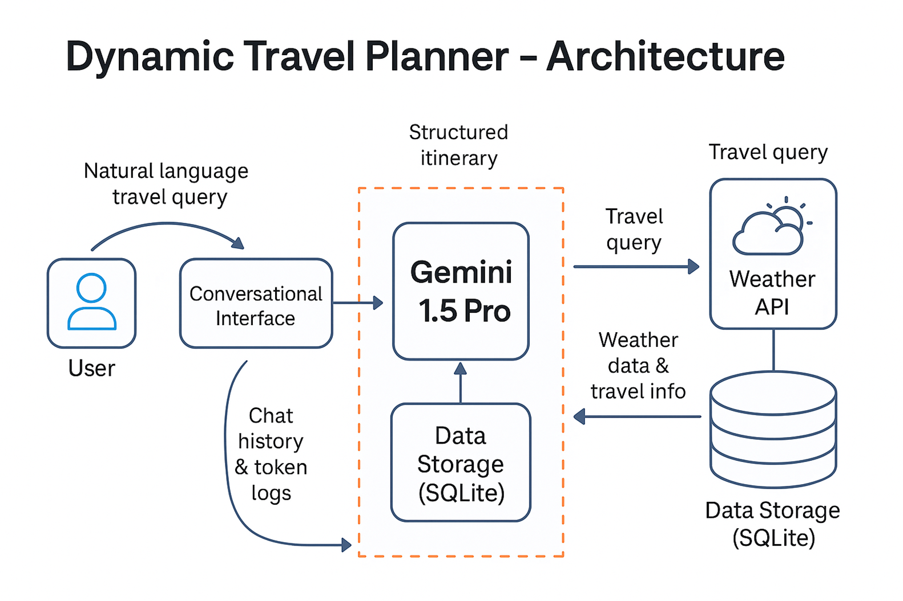

# 🧳 Dynamic Travel Planner — AI Powered Travel Itinerary Generator

> ✈️ Plan your dream trip instantly with AI-generated itineraries, live weather updates, hotel recommendations, and token usage tracking!

---

## 🚀 Project Overview

Dynamic Travel Planner is an AI-based application that **creates personalized travel plans** using Large Language Models (LLMs).  
It also provides **live weather forecasts**, **hotel suggestions**, and **records all trip data** and **token usage costs** into a **local database (SQLite)**.

---

## 🛠️ Tech Stack

- **Python 3.10+**
- **Streamlit** — Conversational Interface
- **Gemini 1.5 Pro (Google Generative AI)** — LLM Model
- **SQLite** — Database (for trips and token usage)
- **OpenWeather API** — Weather forecasting
- **dotenv** — API Key Management
- **Logging** — Error and flow monitoring

---

## 📋 Key Features

- 🗺️ Personalized Travel Itineraries
- 🌦 Live 7-Day Weather Forecasts
- 🏨 Restaurant & Hotel Recommendations
- 💬 Session-Based Persistent Chat Memory
- 💸 Token Usage & Cost Tracking (stored in SQLite)
- 🔐 Environment Variables for API keys (.env)

---

## 🏗️ Architecture Diagram

### 📌 System Architecture

> 📌 The visual representation of how the system components interact:



- **User Input** → **Conversational Interface (Streamlit Chatbot)**
- **LLM Model (Gemini 1.5 Pro)** handles queries and trip generation
- **SQLite Database** stores:
  - Trip itineraries
  - Token costs and usage
- **Weather API** integrates real-time forecast data
- All flows managed using session memory

---

## ⚙️ Setup Instructions

1. **Clone this Repository:**
   ```bash
   git clone https://github.com/your-username/dynamic-travel-planner.git
   cd dynamic-travel-planner
   ```

2. **Install Python Dependencies:**
   ```bash
   pip install -r requirements.txt
   ```

3. **Configure Environment Variables:**
   Create a `.env` file:
   ```
   GOOGLE_API_KEY=your_google_gemini_api_key_here
   OPENWEATHER_API_KEY=your_openweather_api_key_here
   ```

4. **Launch the App:**
   ```bash
   streamlit run app.py
   ```

---

## 🛢️ Database Structure

| Table        | Purpose                       |
|--------------|--------------------------------|
| `trips`      | Store user inputs, destinations, and structured trip plans |
| `trip_costs` | Store token usage counts and the cost of each LLM call     |

---

## 🎯 How it Works (Flow)

1. User asks: _"Plan a trip from Hyderabad to Bangalore"_
2. LLM generates:
   - Overview
   - 3-Day Itinerary
   - Attractions, Budget, Hotels
3. Fetch 7-day weather forecast
4. Store trip & token details into SQLite
5. Display trip beautifully inside Streamlit

---

## 🧠 Future Enhancements

- ✈️ Multi-destination trip planning
- 🏨 Hotel and Flight booking APIs integration
- 🧩 Personalized suggestions based on user profiles
- 📚 Custom Travel Knowledge Base (RAG Implementation)

---

## 👨‍💻 Developer

**Siddartha Kommu**  
[LinkedIn Profile](https://www.linkedin.com) | [GitHub Profile](https://github.com)

---

## 📜 License

This project is licensed under the **MIT License**.

---

# 🚀 Your AI Travel Buddy Awaits!

---

  
